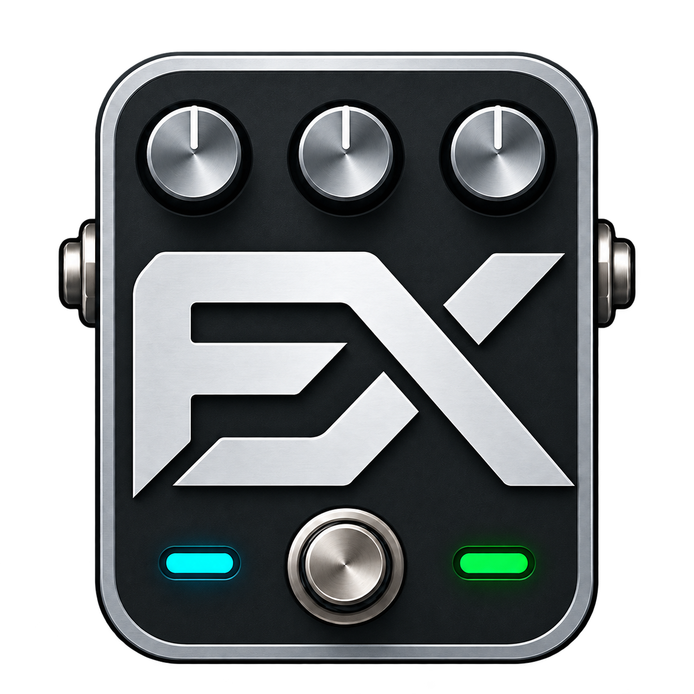

# Guitar & Bass FX

Bas, elektro, akustik ve klasik gitar için geliştirilen telefon ve bilgisayar uygulaması.

**[Ana proje ve yeni sürümler: Guitar & Bass FX](https://github.com/DKDodo/Guitar-Bass-FX)**

Bu depo projenin önceki **BasSahne** yayın adresidir. Eski Windows kurulumlarının güncelleme bağlantısı çalışmaya devam etsin diye korunur. Projenin kaynak kodu özel depoda tutulur; bu açık depoda kaynak kodu yayımlanmaz.

## Önceki Windows kurulumları için geçiş

BasSahne PC 0.3 sürümü güncellemeleri bu depodan denetler. **Güncellemeler** düğmesiyle Guitar & Bass FX 0.4 geçiş paketini bu uyumlu kanaldan alabilir. Geçişten sonra uygulamanın adı ve simgesi Guitar & Bass FX olur; sonraki Windows sürümleri yeni ana depodan gelir.

Bu geçiş paketinin eski dosya adı `BasSahne-PC-0.4.0-windows-x64.zip` olarak korunur. Yeni depodaki `Guitar-Bass-FX-PC-0.4.0-windows-x64.zip` ile aynı uygulama baytlarını içerir. Manifestteki dosya adı eski güncelleyiciyle uyumludur. `BasSahnePC.exe`, kurulum sahiplik bilgisi ve yerel veri konumu da mevcut kurulumların ve kayıtların uyumluluğu için teknik adlarını korur.

[Önceki kurulumlar için geçiş sürümü](https://github.com/DKDodo/BasSahne/releases/latest)

## Windows

[Yeni kurulumlar için son Windows sürümü](https://github.com/DKDodo/Guitar-Bass-FX/releases/latest)

ZIP paketini bir klasöre çıkarıp `BasSahnePC.exe` ile çalıştır. Java ayrıca kurulmaz. **Güncellemeler** düğmesi yeni Windows sürümünü kontrol eder, paketi indirir ve doğruladıktan sonra geçişi başlatır. Otomatik denetim kapatılabilir; paket indirme ve kurulum kullanıcı seçimiyle yapılır.

Pedalboard dosyaları güncelleme paketinden ayrıdır. Önceki uygulama sürümü korunur. Geçişten önce kaydedilmemiş değişiklikler için kayıt seçimi sunulur.

## Mevcut özellikler

- Dört enstrüman profili ve altı yuvalı yerel pedalboard düzenleme.
- Kısa synth ses örnekleri.
- Manuel başlatılan kromatik akort: nota, Hz, sent ve pes/tiz göstergesi.
- Windows için GitHub sürüm denetimi ve indirme.

Bu bir geliştirme önizlemesidir. Gerçek bas/ses kartı ölçüm doğruluğu ve sahne kabulü henüz tamamlanmadı. Canlı pedal zinciri, amfi/kabin, gerçekçi enstrüman dönüşümü, üyelik ve telefonla eşitleme sonraki geliştirme adımlarıdır.

## Güncelleme ve gizlilik

Sürüm denetimi GitHub API'ye bağlanır. İndirme GitHub sürüm dosyalarından yapılır. Pedalboard içeriği ve ses gönderilmez; uygulamada GitHub giriş bilgisi gerekmez. Normal internet bağlantısı bilgileri GitHub hizmetlerine ulaşır. İndirilen Windows ZIP'inin SHA-256 ve boyutu sürüm manifestiyle karşılaştırılır; bu karşılaştırma bağımsız Windows kod imzası değildir.

Android güncellemeleri bu Windows kanalı üzerinden kurulmaz. Google Play yayını henüz yapılmadı. Android ve yeni Windows duyuruları için [Guitar & Bass FX ana deposunu](https://github.com/DKDodo/Guitar-Bass-FX) kullan.
